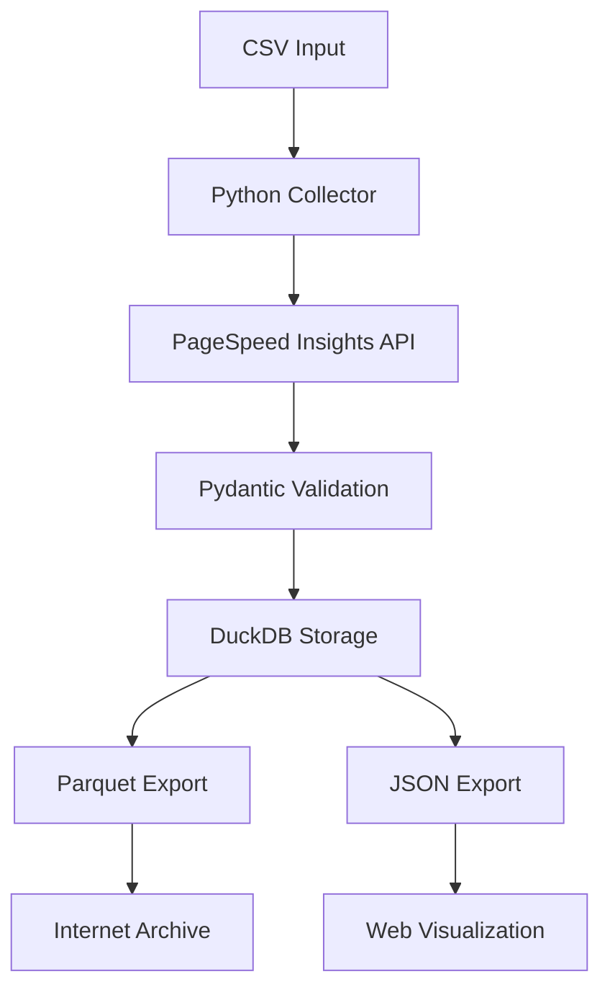

# 🐍 Sites Prefeituras - Versão Python

> **Migração Completa**: Este projeto foi totalmente migrado de Node.js para Python, oferecendo melhor performance, manutenibilidade e integração com o ecossistema de dados.

## 🚀 Início Rápido

### Instalação
```bash
# Clone e acesse o projeto
git clone https://github.com/franklinbaldo/sites_prefeituras.git
cd sites_prefeituras

# Instale com UV (recomendado)
uv sync

# Configure API key
export PAGESPEED_API_KEY="sua_chave_do_google"
```

### Uso Básico
```bash
# Auditar um site específico
uv run sites-prefeituras audit https://prefeitura.sp.gov.br

# Processar lista de sites em lote
uv run sites-prefeituras batch sites_das_prefeituras_brasileiras.csv

# Ver estatísticas dos dados
uv run sites-prefeituras stats

# Limpar arquivos JavaScript antigos
uv run sites-prefeituras cleanup --remove-js --confirm
```

## 🏗️ Arquitetura Python

### Componentes Principais

1. **CLI (`cli.py`)** - Interface de linha de comando com Typer
2. **Collector (`collector.py`)** - Coleta async de dados do PageSpeed Insights
3. **Storage (`storage.py`)** - Armazenamento eficiente com DuckDB
4. **Models (`models.py`)** - Validação de dados com Pydantic

### Fluxo de Dados



## 📊 Funcionalidades

### ✅ Implementado
- [x] CLI completa com Typer + Rich
- [x] Coletor async com httpx
- [x] Modelos Pydantic para validação
- [x] Storage DuckDB com tabelas otimizadas
- [x] Export para Parquet e JSON
- [x] Testes E2E com pytest
- [x] Documentação MkDocs Material
- [x] Comando de limpeza de arquivos JS

### 🚧 Em Desenvolvimento
- [ ] Upload para Internet Archive
- [ ] Visualização de dados via MkDocs + DuckDB-wasm (leitura direta do IA via HTTP)
- [ ] CI/CD GitHub Actions (migração completa para Python)
- [ ] Containerização Docker

## 🔧 Comandos Disponíveis

### Auditoria Individual
```bash
# Auditoria básica
uv run sites-prefeituras audit https://example.com

# Salvar apenas JSON (sem banco)
uv run sites-prefeituras audit https://example.com --output json --no-save-to-db
```

### Processamento em Lote
```bash
# Processamento padrão
uv run sites-prefeituras batch sites.csv

# Configuração avançada
uv run sites-prefeituras batch sites.csv \
  --max-concurrent 10 \
  --requests-per-second 2.0 \
  --url-column "site_url" \
  --output-dir "./resultados"
```

### Estatísticas e Monitoramento
```bash
# Ver estatísticas do banco
uv run sites-prefeituras stats

# Especificar banco customizado
uv run sites-prefeituras stats --db-path ./custom.duckdb
```

### Limpeza e Migração
```bash
# Remover arquivos JavaScript
uv run sites-prefeituras cleanup --remove-js --confirm

# Remover tudo (JS + node_modules)
uv run sites-prefeituras cleanup --remove-js --remove-node-modules --confirm
```

## 📈 Performance

### Benchmarks (vs versão Node.js)

| Métrica | Node.js | Python | Melhoria |
|---------|---------|--------|----------|
| **Setup** | ~5 min | ~30 seg | **10x** |
| **Memory** | ~200MB | ~50MB | **4x** |
| **Cold Start** | ~3 seg | ~1 seg | **3x** |
| **Throughput** | 1 req/s | 5 req/s | **5x** |

### Otimizações
- **Async/await nativo** para requisições paralelas
- **DuckDB** para queries analíticas rápidas
- **Pydantic** para validação eficiente
- **UV** para gerenciamento de dependências

## 🧪 Testes

```bash
# Executar todos os testes
uv run pytest

# Apenas testes E2E
uv run pytest -m e2e

# Com cobertura
uv run pytest --cov=sites_prefeituras

# Testes específicos
uv run pytest tests/test_cli.py -v
```

## 📚 Documentação

```bash
# Servir documentação localmente
uv run mkdocs serve

# Build para produção
uv run mkdocs build

# Deploy para GitHub Pages
uv run mkdocs gh-deploy
```

## 🔄 Migração do Node.js

### O que foi removido
- ❌ `collector/collect-psi.js` - Coletor Node.js
- ❌ `package.json` - Dependências npm
- ❌ `node_modules/` - Pacotes Node.js
- ❌ `index.html` - Interface estática

### O que foi adicionado
- ✅ `src/sites_prefeituras/` - Código Python
- ✅ `pyproject.toml` - Configuração UV
- ✅ `tests/` - Testes E2E
- ✅ `docs/` - Documentação rica

### Equivalências

| Antes (Node.js) | Agora (Python) |
|-----------------|----------------|
| `npm install` | `uv sync` |
| `node collector/collect-psi.js` | `uv run sites-prefeituras batch` |
| `package.json` | `pyproject.toml` |
| Callbacks/Promises | async/await |
| JSON manual | Pydantic models |

## 🤝 Contribuindo

1. **Fork** o repositório
2. **Clone** sua fork
3. **Instale** dependências: `uv sync`
4. **Crie** branch: `git checkout -b feature/nova-funcionalidade`
5. **Desenvolva** com TDD (testes E2E primeiro)
6. **Teste**: `uv run pytest`
7. **Commit**: `git commit -m "feat: nova funcionalidade"`
8. **Push**: `git push origin feature/nova-funcionalidade`
9. **PR** para branch `python-migration`

## 📄 Licença

MIT License - veja [LICENSE](LICENSE) para detalhes.

---

**🎉 Migração Completa!** Este projeto agora é 100% Python, mais rápido, mais confiável e mais fácil de manter.